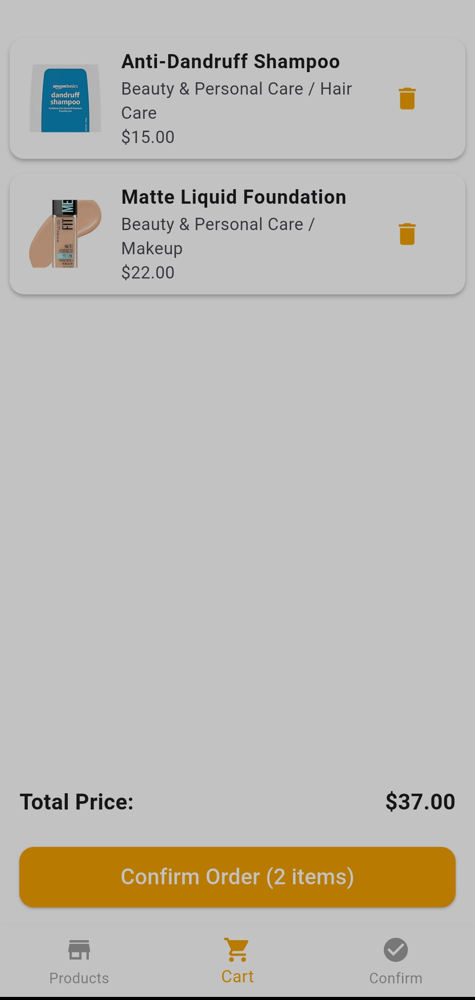

# 🛒 Flutter E-Commerce App

A modern e-commerce mobile application built with **Flutter** and **GetX**.  
The app provides a complete shopping experience including authentication, product browsing, cart management, and order confirmation.

---

## 🚀 Features

### 🔐 Authentication
- Login with email & password  
- User registration (Sign Up)  
- Form validation  
- Local storage with **SharedPreferences**  

### 🏠 Core Features
- Display all products using a **free API**  
- Search functionality powered by API  
- Add / remove items from cart  
- Real-time total price calculation  
- Cart items stored locally using **SharedPreferences**  

### 📦 Orders
- Enter phone & address before confirming  
- Save confirmed orders locally using **SharedPreferences**  
- View confirmed orders history  

### 🎨 UI/UX
- Clean and modern UI  
- Custom primary color theme  
- Responsive layout  

### ⚡ State Management
- GetX for:
  - State management  
  - Navigation  
  - Dependency injection  

---

## 🧱 Architecture

The project follows a clean and scalable structure using:

- MVC Pattern (Model - View - Controller)  
- Separation of concerns  

---

## 🛠️ Tech Stack

- Flutter  
- Dart  
- GetX  
- SharedPreferences for local data storage  
- Free REST API for products  

---

## 📱 Screens

- 🔐 Login Page  
- 📝 Sign Up Page  
- 🏠 Home Page  
- 🛒 Cart Page  
- 📦 Confirmation Page  
- ✅ Confirmed Orders Page  

---

## 📸 Screenshots

### 🔐 Login

### 📝 Sign Up

### 🏠 Home

### 🛒 Cart

### 📦 Confirmation

